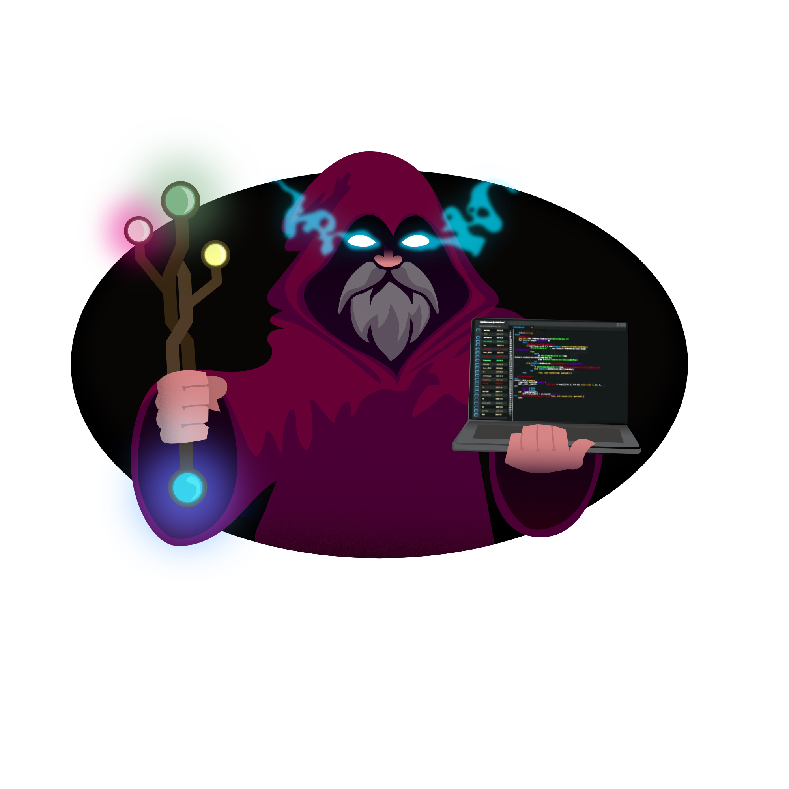

<div id="toc">
<h1>Merge Mages - SideQuest</h1>
</div>


## What is SideQuest?
SideQuest is a collaboration platform for students to team up across different disciplines. Whether a graphic design student wants their artwork turned into a 3D model, or a programmer looking for a new logo for their site. SideQuest makes it easy to find help from classmates with the right skills.

Students can post project requests, called “sidequests”, and others can join in to contribute, learn, and build something together. It’s a fun, flexible way to connect, share talent, and turn creative ideas into real projects.

---

### Conventions

#### Naming Conventions
- **Variables & Functions**: `camelCase`
- **Classes & Components**: `PascalCase`
- **Constants**: `UPPER_SNAKE_CASE`
- **Files**: `kebab-case`
- **Database Tables**: `snake_case`
- **API Endpoints**: `kebab-case` (e.g., `/api/user-profiles`)

---

### Git Workflow

#### Branch Naming
- `feature/feature-name` - New features
- `bugfix/issue-description` - Bug fixes
- `hotfix/critical-fix` - Production hotfixes
- `refactor/description` - Code refactoring
- `docs/description` - Documentation updates

#### Commit Messages
Follow the Conventional Commits specification:
- `feat: add user authentication`
- `fix: resolve login redirect issue`
- `docs: update API documentation`
- `style: format code according to style guide`
- `refactor: restructure user service`
- `test: add unit tests for auth module`
- `chore: update dependencies`

---

#### API Design
- Version APIs: `/api/v1/resource`
- HTTP Methods:
  - `GET` - Retrieve resources
  - `POST` - Create resources
  - `PUT/PATCH` - Update resources
  - `DELETE` - Remove resources
- Status Codes:
  - `200` - Success
  - `201` - Created
  - `400` - Bad Request
  - `401` - Unauthorized
  - `403` - Forbidden
  - `404` - Not Found
  - `500` - Internal Server Error

#### Error Handling
- Always use try-catch blocks for async operations
- Return consistent error response format:
```json
{
  "error": {
    "message": "Error description",
    "code": "ERROR_CODE",
    "details": {}
  }
}
```

---

### Database Conventions

#### Schema Design
- Use singular names for tables (e.g., `user` not `users`)
- Primary key: `id` (auto-increment integer or UUID)
- Timestamps: `created_at`, `updated_at` on all tables
- Foreign keys: `{table_name}_id` (e.g., `user_id`)

---

### Security

- Never commit secrets, API keys, or credentials
- Use environment variables for configuration
- Sanitize all user inputs
- Hash passwords with bcrypt (minimum 10 rounds)
- Validate and sanitize file uploads

---

### Code Review

- Review code before merging
- Address comments before merging
- Test locally before requesting review
- Keep PRs focused and under 400 lines when possible

---
